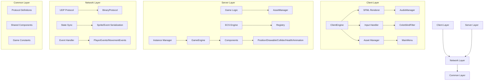

# R-Type Developer Guide

## 🏗️ Architecture Overview

### System Architecture



## 🛠️ Core Systems

### Entity Component System (ECS)

The game uses a modular ECS architecture with these core components:

```c++
// Position Component
class Position : public Component {
    int x, y;
    int currentFrame = 0;
    std::chrono::steady_clock::time_point lastFrameUpdate;
};

// Health Component
class Health : public Component {
    int lives = 3;
};

// Example entity creation
Entity player = registry.spawnEntity();
registry.addComponent<Position>(player, {100, 100});
registry.addComponent<Health>(player, {3});
```

### Network Protocol

As detailed in the RFC document, our protocol uses:

- UDP-based binary communication
- Little-endian byte order
- No compression/encryption
- Event-based messaging system

## 📚 Development Tutorials

### Adding a New Enemy Type

1. Create component definition:

```c++
class EnemyComponent : public Component {
public:
    EnemyComponent(int health, float speed) : 
        health(health), speed(speed) {}
    int health;
    float speed;
};
```

2. Register in game system:

```c++
registry.registerComponent<EnemyComponent>();
```

3. Add system logic:

```c++
registry.addSystem<Position, EnemyComponent>([](Registry& registry,
    SparseArray<Position>& positions,
    SparseArray<EnemyComponent>& enemies) {
    // Implement enemy behavior
});
```

### Creating a New Game Mode

1. Define mode configuration:

```c++
struct GameModeConfig {
    bool enableObstacles = true;
    bool enableBackground = true;
    int playerLives = 3;
};
```

2. Implement mode logic in GameEngine class

## 🔧 Build & Development

### Environment Setup

```bash
# Install dependencies (Ubuntu)
sudo apt-get update
sudo apt-get install -y cmake g++ libsfml-dev

# Build project
./build.sh
```

### Project Structure

```
src/
├── client/ # Client implementation
│   ├── assets/ # Game assets
│   │   ├── fonts/ # Game fonts
│   │   ├── sounds/ # Sound effects and music
│   │   ├── shaders/ # GLSL shaders
│   │   └── sprites/ # Game sprites
│   ├── src/ # Client source code
│   │   ├── AudioManager/ # Audio system
│   │   ├── ClientEngine/ # Main client engine
│   │   ├── Components/ # UI components
│   │   │   ├── Button/ # Button component
│   │   │   ├── Modal/ # Modal window system
│   │   │   ├── Slider/ # Slider component
│   │   │   └── TextField/ # Text input component
│   │   ├── InputManager/ # Input handling
│   │   ├── MainMenu/ # Menu system
│   │   └── Utils/ # Utility classes
│   └── Client.hpp # Main client class
├── server/ # Server implementation
│   ├── Engine/ # Game engine core
│   │   ├── Components/ # ECS components
│   │   │   ├── Animation.hpp
│   │   │   ├── Collider.hpp
│   │   │   ├── Health.hpp
│   │   │   ├── Position.hpp
│   │   │   └── Projectile.hpp
│   │   ├── AssetManager.hpp # Asset management
│   │   ├── GameEngine.hpp # Core game logic
│   │   ├── Network.hpp # Network handling
│   │   └── Registry.hpp # ECS registry
│   ├── Game/ # Game logic
│   │   ├── Server.hpp # Server implementation
│   │   └── Server.cpp # Server implementation
│   └── main.cpp # Server entry point
└── common/ # Shared code
    └── src/ # Common source files
        ├── Protocol.hpp # Network protocol
        └── Protocol.cpp # Protocol implementation
```

## 📡 Network Protocol

### Event Types

- MOVE: Player movement
- SHOOT: Basic shooting
- CHARGED_SHOOT: Charged weapon
- JOIN: Player connection
- DESTROY: Entity destruction
- BOSS_FIGHT: Boss fight starting

### Packet Structure

```c++
struct PlayerEvent {
    Event event;           // 1 byte
    unsigned int playerId; // 4 bytes
};

struct PlayerEventMove {
    Direction dx;          // 1 byte
    Direction dy;          // 1 byte
    unsigned int playerId; // 4 bytes
};
```

## 🎮 Game Configuration

### Constants

```c++
const int WINDOW_WIDTH = 1128;
const int WINDOW_HEIGHT = 672;
const int MAX_PLAYERS = 4;
const int DEFAULT_PORT = 4242;
```

### Asset Configuration

Assets are managed through the AssetManager class with predefined gameplay assets:

- PLAYER
- PLAYER_PROJECTILE
- PLAYER_CHARGED_PROJECTILE
- OBSTACLE_SMALL/MEDIUM/LARGE
- BACKGROUND
- DEATH


## 🔧 Extending the Game Engine

### Adding New Components

1. Create a new component class in `src/server/Engine/Components/`:

```cpp
class NewComponent : public Component {
public:
    NewComponent(int value) : value(value) {}
    int value;
};
```

2. Register it in GameEngine constructor:

```cpp
registry.registerComponent<NewComponent>();
```
3. Add relevant systems in GameEngine :

```cpp
registry.addSystem<NewComponent, Position>([](Registry& registry,
    SparseArray<NewComponent>& components,
    SparseArray<Position>& positions) {
    // Implement component behavior
});
```

### Adding New Game Features

1. Define new assets in AssetManager :

```cpp
enum class GameplayAsset {
    // Add new asset types
    NEW_ENEMY,
    NEW_POWERUP
};
```

2. Create new components and systems for the feature:
    - Components in Components
    - Systems in GameEngine.cpp
    - Network events in Protocol.hpp

3. Add sprite/asset loading in ClientEngine

For more information, please reach out to the project maintainers.