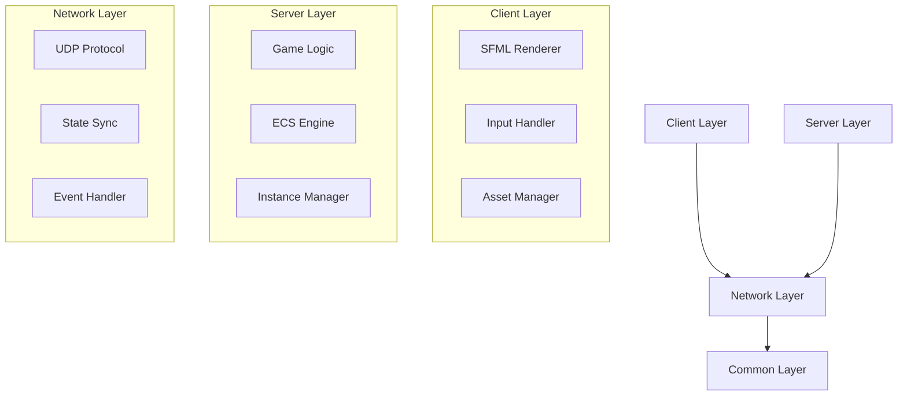

# R-Type Developer Guide

## 🏗️ Architecture Overview

### System Architecture


## 🛠️ Core Systems

### Entity Component System (ECS)

The game uses a modular ECS architecture with these core components:

```c++
// Position Component
class Position : public Component {
    int x, y;
    int currentFrame = 0;
    std::chrono::steady_clock::time_point lastFrameUpdate;
};

// Health Component
class Health : public Component {
    int lives = 3;
};

// Example entity creation
Entity player = registry.spawnEntity();
registry.addComponent<Position>(player, {100, 100});
registry.addComponent<Health>(player, {3});
```

### Network Protocol
As detailed in the RFC document, our protocol uses:

- UDP-based binary communication
- Little-endian byte order
- No compression/encryption
- Event-based messaging system

## 📚 Development Tutorials

### Adding a New Enemy Type

1. Create component definition:
```c++
class EnemyComponent : public Component {
public:
    EnemyComponent(int health, float speed) : 
        health(health), speed(speed) {}
    int health;
    float speed;
};
```

2. Register in game system:
```c++
registry.registerComponent<EnemyComponent>();
```

3. Add system logic:
```c++
registry.addSystem<Position, EnemyComponent>([](Registry& registry,
    SparseArray<Position>& positions,
    SparseArray<EnemyComponent>& enemies) {
    // Implement enemy behavior
});
```

### Creating a New Game Mode

1. Define mode configuration:
```c++
struct GameModeConfig {
    bool enableObstacles = true;
    bool enableBackground = true;
    int playerLives = 3;
};
```

2. Implement mode logic in GameEngine class

## 🔧 Build & Development

### Environment Setup
```bash
# Install dependencies (Ubuntu)
sudo apt-get update
sudo apt-get install -y cmake g++ libsfml-dev

# Build project
./build.sh
```

### Project Structure
```
src/
├── client/         # Client implementation
├── server/         # Server implementation
│   ├── Engine/     # Game engine core
│   ├── Game/       # Game logic
│   └── main.cpp
└── common/         # Shared code
```

## 📡 Network Protocol

### Event Types

- MOVE: Player movement
- SHOOT: Basic shooting
- CHARGED_SHOOT: Charged weapon
- JOIN: Player connection
- DESTROY: Entity destruction

### Packet Structure

```c++
struct PlayerEvent {
    Event event;           // 1 byte
    unsigned int playerId; // 4 bytes
};

struct PlayerEventMove {
    Direction dx;          // 1 byte
    Direction dy;          // 1 byte
    unsigned int playerId; // 4 bytes
};
```

## 🎮 Game Configuration

### Constants
```c++
const int WINDOW_WIDTH = 1128;
const int WINDOW_HEIGHT = 672;
const int MAX_PLAYERS = 4;
const int DEFAULT_PORT = 4242;
```

### Asset Configuration

Assets are managed through the AssetManager class with predefined gameplay assets:

- PLAYER
- PLAYER_PROJECTILE
- PLAYER_CHARGED_PROJECTILE
- OBSTACLE_SMALL/MEDIUM/LARGE
- BACKGROUND
- DEATH


For more information, please reach out to the project maintainers.